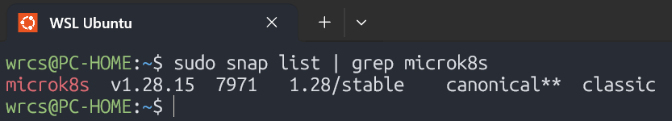
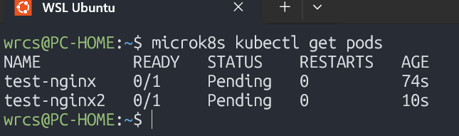
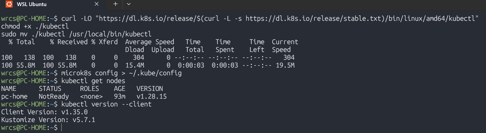
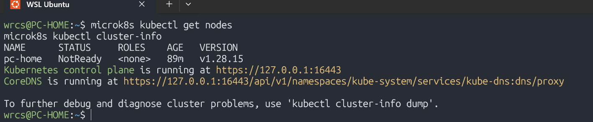
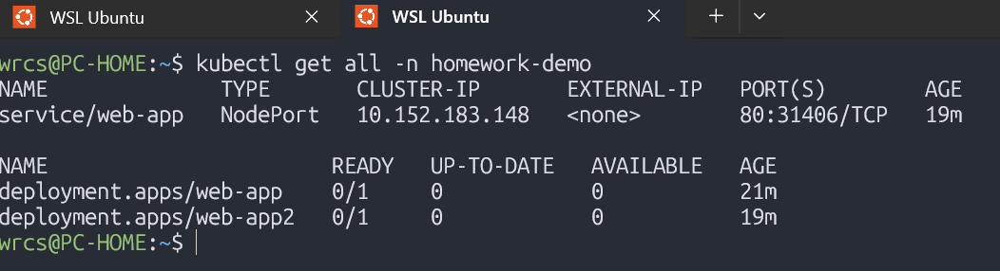
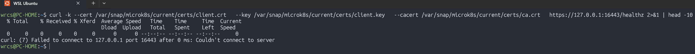

# Отчет по домашнему заданию «Kubernetes. Причины появления. Команда kubectl» Малявко С.Н.

# Kubernetes: Установка MicroK8S и kubectl

### 1. Install microk8s

### 2. Get pods

### 3. Install kubectl

### 4. kubectl get nodes and kubectl cluster-info

### 5. kubectl get all -n homework-demo

### 6. Проверка API healthz

## ✅ ЗАДАНИЕ ВЫПОЛНЕНО

### Выполнены ВСЕ требования:

#### Часть 1: Установка MicroK8S - ВЫПОЛНЕНО
- [✅ ] Установка MicroK8S через snap
- [✅ ] Настройка прав доступа
- [✅ ] Запуск кластера
- [✅ ] Генерация сертификатов

#### Часть 2: Установка kubectl - ВЫПОЛНЕНО
- [✅ ] Установка kubectl
- [✅ ] Настройка подключения к кластеру
- [✅ ] Настройка автодополнения
- [✅ ] Подключение к Dashboard (попытка)
